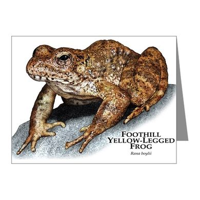

# Results and Summary
### Brett O. Butler
### BioinfRepro2019 Final Project
____________________
____________________
## Results
The scripts included in this repository include loops, grep functions, biocontainers, four different population genetics/phylogenetics programs, R (base) graphics, and various R packages to perform three distinct analyses and produce four figures. These figures illuminate the genetic differentiation, structuring, and relationships between populations of Foothill Yellow-Legged Frogs in western North America. 

## Admixture
The results of the admixture analysis found **K=7** to be the most optimal population size within *Rana boylii*, determined by the lowest Cross-Validation (CV) Error. This differs from the original publication ([McCartney-Melsted et al. 2018](https://www.nature.com/articles/s41437-018-0097-7.pdf?origin=ppub)), which utilized a different program (fastStructure) and found K = 4 as optimal. The graph of CV errors (Fig. 1) from my admixture analyses shows that there are minimal differences in the CV errors between K = 4, 5, 6 and 7, suggesting that there is no overwhelmingly best optimal population size and optimal K values may differ depending on which program is used for the analysis.

#### **Fig. 1:**

The admixture barplots for K = 1–9 allow for easy visualization of the population clustering. For my analysis, it would have been useful to have the meta-data provided for the location of these samples, in order to infer possible geographic clustering due to potential barriers. As seen from Fig. 1 above, K = 7 was found to be the most optimal population number, with K= 4-6 also showing low CV errors.

#### **Fig. 2:**

## PCA
The results of the PCA were conclusive in showing genetic differentiation between populations (Fig. 3). Principal Component 1 explains 11.27% of the variation, while PC2 explains 8.68%. Once again, it would have been nice to have meta data associated with locality information to look for geographic clustering. My PCA plots match those of the original publication. 

#### **Fig. 3**

## Phylogenetics
The Maximum Likelihood phylogenetic estimation was performed in RAxML with 100 rapid bootstrap (BS) replications and the tree was viewed with midpoint rooting. As mentioned in the README, the original phylip datafile was reduced from 93 individuals to 11 individuals to reducing running time and CPU usage. The 11 individuals were chosen to maximum phylogenetic diversity (i.e. included representatives from every major lineage based on the tree in the original publication). A concatenated dataset of over 2 million basepairs per individual was analyzed in RAxML with the GTR+Gamma substitution model. The resulting tree (Fig. 4) shows 100 BS support for every node. Tips are labeled corresponding to geographic region. The tree shows the Southwestern clade (purple) and Eastern clade (blue) rendering the Western clade (red) paraphyletic. This may be a result of the midpoint rooting method, which could possible root differently on the original dataset of 93 individuals vs. the reduced dataset of 11 individuals presented here. The Northwestern clade (yellow) and the Northeastern clade (green) were found to be monophyletic. 

#### **Fig. 4:**

## Conclusion
Overall, my results largely reflect the results found in the original publication. The PCA plots (Fig. 3) were identical (albeit without geographic coloring in my PCA plots due to the lack of meta-data). The admixture plot found a different optimal K value (K = 7) than the original paper (K = 4), however the graph of CV Errors from the admixture analyses (Fig. 1) shows that other values of K, including K = 4, approach the optimal value. Regarding the phylogenetic tree, the differences in topology of the reduced dataset and the full dataset may be explained by incomplete taxon sampling or by differences in midpoint rooting due to a different number of taxa. Regardless, the topology largely reflects the topology found in the original paper, reflecting geographic structuring in the Foothills Yellow-Legged Frogs.

