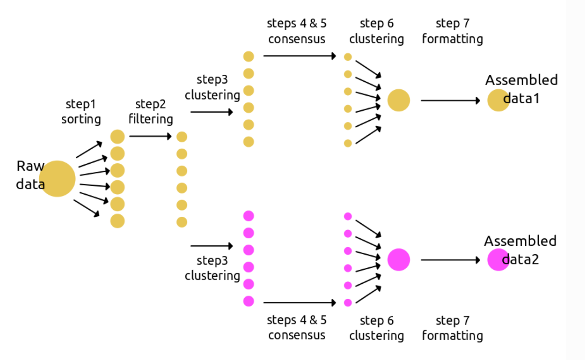

### Introducción a la Bioinformática
### Tarea 9.1: Ensamblaje de Genomas
_____
Brett O. Butler

Estudiante de Doctorado

Facultad de Ciencias

Universidad Nacional Autónoma de México
____
22 de mayo de 2019
____

#### Introducción

El ensamblaje de genomas reducidos se puede realizar en varias programas bioinformáticas. Uno de ellos se llama [ipyRAD](https://ipyrad.readthedocs.io/index.html) (Eaton et al. 2014), y tiene la ventaja de ser fácil descargar y usar, dado su documentación extensa, varias tutoriales, y foros activos de usuarios. La documentación explica los siete pasos del flujo de trabajo (Fig. 1), que pueden ser modificado para diferentes parámetros dependiendo en el data. ipyRAD tiene varias opciones para los archivos de salida para usar en análises posteriores, incluyendo **.vcf**, **.loci**, **.phy**, **.geno**, **.str**, y **.nex**.


**Figura 1**: Flujo de trabajo del ensamblaje dentro de ipyRAD. Se puede crear distintas ramas del ensamblaje para probar el efecto de diferentes parametros o para distintas analisis posteriores.

La ventaja de iPyrad es la facilidad de modificar los parámetros, que se encuentran en un solo archivo `params.txt`. Para los mismos datos crudos, se puede explorar el efecto de distintos valores de diferentes parámetros usando diferentes ramas del flujo de trabajo (Fig. 1). Hay 28 diferentes parámetros que utiliza ipyRAD durante los diferentes pasos del ensemblaje. El programa indica valores por default para cada parámetro, sin embargo, es necesario modificar varios de los parámetros dependiendo en los datos y el tipo de analisis posterior. Unos parámetros son más sensibles de otros, y por eso es importante optimizar esos parámetros. Dos de estos incluyen *min\_samples_locus* y *clust\_threshold*. Estos dos parámetros están explicados abajo, junto con estrategias para optimizarlos y rangos de valores para variar.


#### Discusión

El efecto de diferentes parámetros en ipyrad puede resultar en diferentes ensamblajes del genoma reducida. Siempre es buena idea afinar el ensamblaje por probar diferentes valores de distantas parámetros. Dos de los parámetros más senisbles en el ensamblaje son ***min\_samples_locus*** y ***clust\_threshold***. El primero es el número mínimo de muestras que tienen datos en un cierto locus para que ese locus se queda en el set de datos finales. Con un valor igual al número de muestras en el set de datos, solo los loci que contienen datos de todas las muestras serán incluido. Con un valor más bajo, se incluye todos los loci que tienen ese número de muestras.

El parámetro ***clust\_threshold*** determina el nivel de similitud entre dos secuencias para que se clasifiquen como homólogos. Con un valor bajo (i.e. 0.70), dos secuencias que son parecidas pero no homólogas pueden ser consideradas como homólogas, por error. Con un valor demasiado alto (i.e. 0.98), dos secuencias homólogas no se agrupan dado la presencia de sitios polimórficos o por la presencia de 'Ns'.

Idealmente, estos parámetros deben de ser a un nivel suficientemente relajado para reconocer variación genética y errores en secuenciación, pero suficientemente estrictos para identificar loci parálogos. Usando distintas estrategias, se puede optimizar estos parámetros. Una estrategia se llama el método ***r80***. En esta, se varian los parámetros y se seleccionan los valores que maximizan el número de loci polimórficos que se encuentran en 80% de los individuos. Por ejemplo, para el parámetro ***min\_samples_locus***, se puede probar diferentes valores de 2, 4, 6, 8, y 10, creando una rama nueva para cada prueba:

```
# crear un ensamblaje initial y archivo de parámetros (params-data1.txt) con min_samples_locus = 2
ipyrad -n data1

# correr pasos 1-2 con este archivo de parámetros
ipyrad -p params-data1.txt -s 12

# crear una nueva rama de 'data1' antes de correr el paso 3, llamado 'data2'
ipyrad -p params-data1.txt -b data2

# editar el archivo de parámetros para data2, 'params-data2.txt'

# hacer el mismos para data3, data4, y data5, cambiando el valor de min_samples_locus a 6, 8, 10

# correr pasos 3-7 para los 5 ensamblajes
ipyrad -p params-data1.txt -s 34567
ipyrad -p params-data2.txt -s 34567
ipyrad -p params-data3.txt -s 34567
ipyrad -p params-data4.txt -s 34567
ipyrad -p params-data5.txt -s 34567
```

Después de revisar los cinco ensamblajes, se escoja el valor del parámetro ***min\_samples_locus*** que máximiza el número de loci polimórficos que se encuentran en 80% de los individuos.

Para el parámetro ***clust\_threshold***, yo exploraría valores de 0.80, 0.85. 0.90, y 0.95, usando el mismo método de ***r80*** que se demuestra arriba con ***min\_samples_locus***.

Usando este método, se puede optimizar los parámetros más sensibles para tener un set de datos ensamblado que refleja la variación genética, con errores de secuenciación filtrados, y loci parálagos identificados y filtrados también. De manera igual con el método de ramas diferentes en ipyRAD, se puede ensemblar diferentes sets de datos para distintas analisis posteriores (filogenéticas, genética de población, STRUCTURE, etc.).